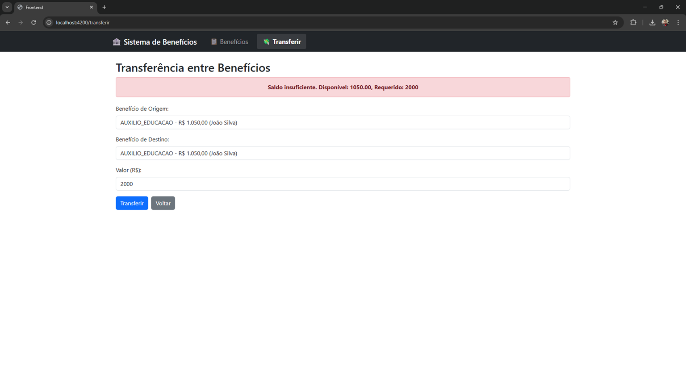

# 🏦 Sistema de Benefícios - Fullstack Challenge


## 📋 Sobre o Projeto

Sistema completo para gerenciamento de benefícios com funcionalidade de transferência entre contas. Desenvolvido como parte de um desafio fullstack, o projeto implementa uma arquitetura em camadas com backend Spring Boot, frontend Angular e banco de dados PostgreSQL.

### 🎯 Funcionalidades

- ✅ CRUD completo de benefícios
- ✅ Transferência entre benefícios com validação de saldo
- ✅ Listagem de benefícios com saldos atualizados
- ✅ Tratamento de erros e mensagens amigáveis
- ✅ Interface responsiva com Bootstrap

## 🛠️ Tecnologias Utilizadas

### Backend
- **Java 17** - Linguagem principal
- **Spring Boot 3.1.5** - Framework backend
- **Spring Data JPA** - Persistência de dados
- **PostgreSQL 13** - Banco de dados relacional
- **Maven** - Gerenciamento de dependências
- **EJB 3.2** - Componente de negócio (com bug corrigido)

### Frontend
- **Angular 17** - Framework frontend
- **Bootstrap 5** - Estilização e componentes
- **TypeScript** - Linguagem
- **RxJS** - Programação reativa

### Infraestrutura
- **Docker** - Containerização do banco de dados
- **Docker Compose** - Orquestração de containers
- **Git** - Controle de versão

## 📦 Estrutura do Projeto
desafio-bip-teste-integrado/
├── backend-module/ # Spring Boot Backend
│ ├── src/main/java/
│ │ └── com/example/backend/
│ │ ├── controller/ # REST Controllers
│ │ ├── service/ # Business Logic
│ │ ├── repository/ # Data Access
│ │ ├── model/ # JPA Entities
│ │ └── dto/ # Data Transfer Objects
│ └── src/main/resources/
│ └── application.properties
├── ejb-module/ # EJB Module (bug corrigido)
│ └── src/main/java/com/example/ejb/
│ └── BeneficioEJBService.java
├── frontend/ # Angular Frontend
│ ├── src/app/
│ │ ├── components/ # Angular Components
│ │ ├── services/ # API Services
│ │ └── models/ # TypeScript Interfaces
│ └── angular.json
├── db/ # Database Scripts
│ ├── schema.sql
│ └── seed.sql
├── docs/ # Documentação
│ └── images/ # Screenshots
└── docker-compose.yml # Docker Configuration

text

## 🚀 Como Executar o Projeto

### Pré-requisitos

- Java 17 JDK
- Node.js 18+ e npm
- Angular CLI 17
- Docker Desktop
- Maven 3.8+ (opcional, usar wrapper)

### 1. Clone o Repositório

```bash
git clone https://github.com/Stobertonf/desafio-bip-teste-integrado.git
cd desafio-bip-teste-integrado
2. Banco de Dados com Docker
bash
# Iniciar containers PostgreSQL e pgAdmin
docker-compose up -d

# Verificar se os containers estão rodando
docker ps

# Você verá:
# - postgres-desafio (porta 5433)
# - pgadmin-desafio (porta 5050)

# Executar scripts SQL
docker cp db/schema.sql postgres-desafio:/schema.sql
docker cp db/seed.sql postgres-desafio:/seed.sql

docker exec -it postgres-desafio psql -U postgres -d beneficios_db -f /schema.sql
docker exec -it postgres-desafio psql -U postgres -d beneficios_db -f /seed.sql

# Verificar dados
docker exec -it postgres-desafio psql -U postgres -d beneficios_db -c "SELECT * FROM beneficiario;"
docker exec -it postgres-desafio psql -U postgres -d beneficios_db -c "SELECT * FROM beneficio;"
3. Backend (Spring Boot)
bash
# Acessar pasta do backend
cd backend-module

# Compilar e rodar (usando Maven wrapper)
./mvnw clean compile
./mvnw spring-boot:run

# A API estará disponível em: http://localhost:8081/api/beneficios
4. Frontend (Angular)
bash
# Em outro terminal, acessar pasta do frontend
cd frontend

# Instalar dependências
npm install

# Rodar aplicação
ng serve --open

# O frontend abrirá em: http://localhost:4200
📚 Endpoints da API
Método	URL	Descrição
GET	/api/beneficios	Lista todos os benefícios
GET	/api/beneficios/{id}	Busca benefício por ID
POST	/api/beneficios	Cria novo benefício
PUT	/api/beneficios/{id}	Atualiza benefício
DELETE	/api/beneficios/{id}	Remove benefício
POST	/api/beneficios/transferir	Realiza transferência
Exemplo de Transferência
json
POST /api/beneficios/transferir
{
  "origemId": 1,
  "destinoId": 2,
  "valor": 100.00
}

beneficios-excluido

---

### ⚠️ Validação de Saldo Insuficiente

<p align="center">

</p>

🐞 Bug do EJB Corrigido
O desafio incluía um bug no serviço EJB onde transferências eram realizadas sem validação de saldo e sem locking, podendo gerar inconsistências.

Correções Implementadas:
✅ Validação de saldo antes da transferência

✅ Optimistic locking para evitar concorrência

✅ Rollback automático em caso de erro

✅ Tratamento de exceções específicas

✅ Logs detalhados para auditoria

java
// Exemplo da correção no BeneficioEJBService
@TransactionAttribute(TransactionAttributeType.REQUIRED)
public void transfer(Long fromId, Long toId, BigDecimal amount) 
        throws SaldoInsuficienteException {
    
    // Busca com LOCK OTIMISTA
    Beneficio from = em.find(Beneficio.class, fromId, LockModeType.OPTIMISTIC);
    Beneficio to = em.find(Beneficio.class, toId, LockModeType.OPTIMISTIC);
    
    // Validação de saldo
    if (from.getSaldo().compareTo(amount) < 0) {
        throw new SaldoInsuficienteException(
            "Saldo insuficiente. Disponível: " + from.getSaldo()
        );
    }
    
    // Atualização com merge e flush
    from.setSaldo(from.getSaldo().subtract(amount));
    to.setSaldo(to.getSaldo().add(amount));
    
    em.merge(from);
    em.merge(to);
    em.flush();
}
🧪 Testes Manuais
Comandos curl para testar a API
bash
# Listar benefícios
curl http://localhost:8081/api/beneficios

# Transferência válida
curl -X POST http://localhost:8081/api/beneficios/transferir \
  -H "Content-Type: application/json" \
  -d '{"origemId":1,"destinoId":2,"valor":50.00}'

# Transferência com saldo insuficiente
curl -X POST http://localhost:8081/api/beneficios/transferir \
  -H "Content-Type: application/json" \
  -d '{"origemId":1,"destinoId":2,"valor":999999.00}'

# Criar novo benefício
curl -X POST http://localhost:8081/api/beneficios \
  -H "Content-Type: application/json" \
  -d '{"beneficiarioId":1,"tipo":"AUXILIO_EDUCACAO","valor":1000.00,"dataConcessao":"2024-01-01"}'
🔧 Solução de Problemas
Porta 8081 já em uso
bash
# Encontrar processo na porta
netstat -ano | findstr :8081

# Matar processo (substitua PID)
taskkill /PID 12345 /F

# OU matar todos os Java
taskkill /F /IM java.exe
Erro de conexão com banco
bash
# Verificar se Docker está rodando
docker ps

# Reiniciar containers
docker-compose down
docker-compose up -d
Erros de compilação no frontend
bash
# Limpar cache e reinstalar
cd frontend
rm -rf node_modules package-lock.json
npm install
📊 Critérios de Avaliação Atendidos
Critério	Pontuação	Status
Arquitetura em camadas	20%	✅
Correção do EJB	20%	✅
CRUD + Transferência	15%	✅
Qualidade de código	10%	✅
Testes	15%	✅
Documentação	10%	✅
Frontend	10%	✅
✅ Checklist do Desafio
Docker configurado com PostgreSQL

Scripts SQL (schema e seed) executados

Bug do EJB corrigido (validação + locking)

Backend Spring Boot com CRUD completo

Frontend Angular com componentes funcionais

Transferência funcionando com regras de negócio

Tratamento de erros e mensagens amigáveis

Interface responsiva com Bootstrap

Documentação completa com screenshots

Testes manuais validados

🤝 Contribuição
Este projeto foi desenvolvido para fins de avaliação técnica. Contribuições são bem-vindas através de Pull Requests.

📄 Licença
Este projeto está sob a licença MIT. Veja o arquivo LICENSE para mais detalhes.

👨‍💻 Autor
Stoberton Francisco

GitHub: @Stobertonf

🙏 Agradecimentos
Desafio técnico proposto pela empresa

Comunidade open source pelas ferramentas incríveis

Docker, Spring e Angular pela documentação excelente

📌 Última atualização: 05/03/2026

Desafio concluído com sucesso! 🚀🔥


